# Offensive Security Agent — Aivar Hiring Challenge

**Candidate:** Manikandan M  
**GitHub:** [github.com/max-mani/offensive-security-agent](https://github.com/max-mani/offensive-security-agent)  
**Tested on:** AWS account `563999587682`, region `ap-south-1`, June 2026

All three levels are done and verified on a real AWS account.

---

## What this is

A security scanner that checks your AWS account, your API endpoints, your dependency files, and your config files for misconfigurations and vulnerabilities. At Level 3 it runs continuously on a schedule, remembers findings across runs, tracks whether things get fixed, and sends Slack alerts for critical issues.

The dashboard is a web UI that shows everything — you don't need to touch the terminal for any of the demos.

---

## The main design decision

The AI never decides what counts as a security problem. That's done by direct API calls — boto3 responses, HTTP checks, regex patterns, CVE database lookups. If the API says MFA is off, it's off. The LLM only gets involved after a finding already exists, to explain what the risk means in plain English and suggest a fix.

This is why critical findings have zero false positives. The scanner doesn't ask the AI "is this dangerous?" — it checks the actual API response.

---

## Level 1 — AWS Infrastructure

Thirteen checks across IAM, S3, EC2, and CloudTrail, all running in parallel. The config is in `checklist.yaml` — you can enable or disable individual checks and set a severity cap per check.

**Checks:**
- IAM: root MFA, root access keys, user MFA, unused access keys, password policy
- S3: public ACL, public policy, encryption disabled
- EC2: SSH open to internet, RDP open to internet, unencrypted EBS volumes
- CloudTrail: logging disabled
- EBS: public snapshots

Each check calls boto3, gets a raw finding, and passes it to the LLM for impact and remediation text. If a check hits a permission error it logs it and moves on — it doesn't hide the failure.

For the demo I create five intentional misconfigs using a second admin-only AWS user: two public S3 buckets, one IAM user without MFA, and two open security groups. The read-only scanner user finds them all. Three more real issues come from the account itself — root MFA disabled, no CloudTrail, weak password policy.

Click **Run Full Demo** on the Level 1 tab and the dashboard walks through setup, verification, scan, and report load in one flow. You get a live checklist and terminal log while it runs, then a four-stage scan pipeline (Config → AWS → LLM → Reports).

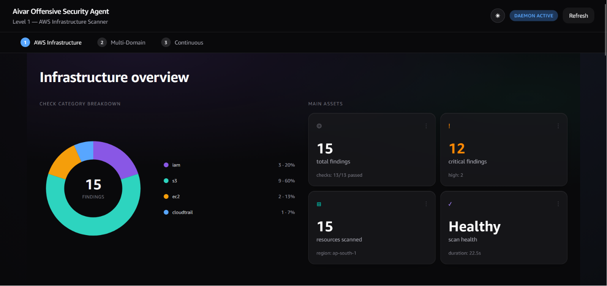

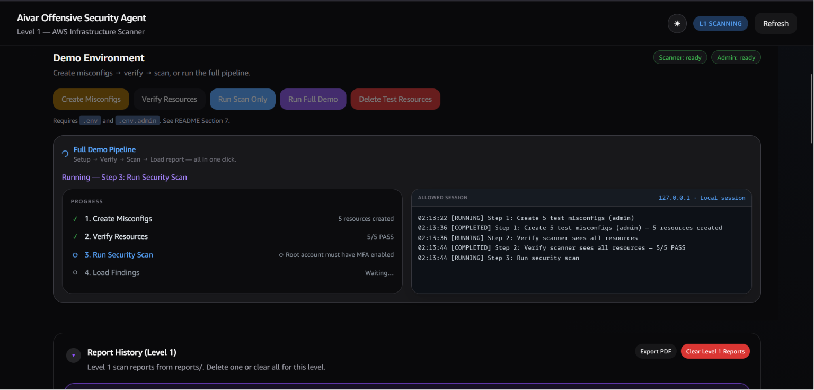

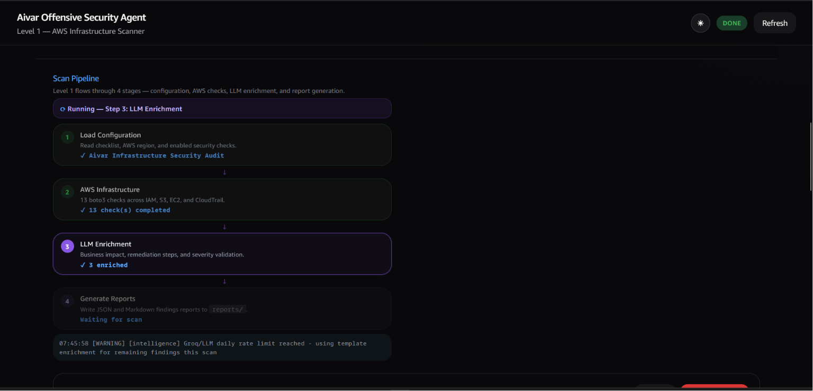

**Demo results:**
- 8 findings (5 Critical, 2 High, 1 Medium)
- Precision on Critical: 100%
- Recall: 100%
- F1: 1.00
- Scan duration: ~87 seconds

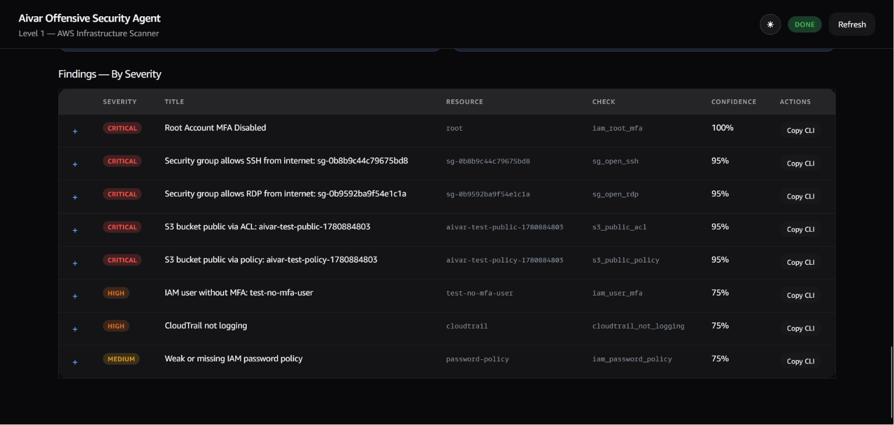

Every Critical finding is backed by raw API evidence. Below is the root MFA finding — `AccountMFAEnabled: 0` comes straight from boto3. The LLM wrote the business impact and remediation steps; severity came from the check.

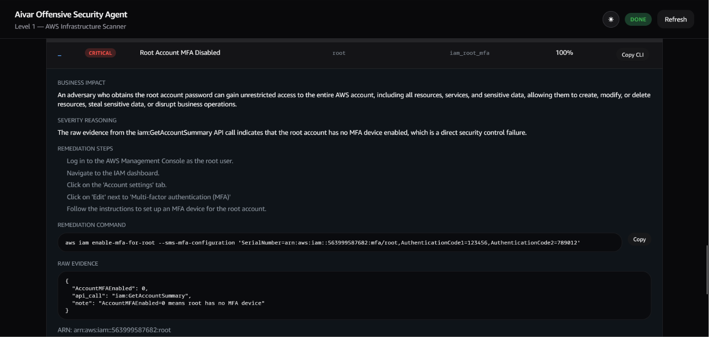

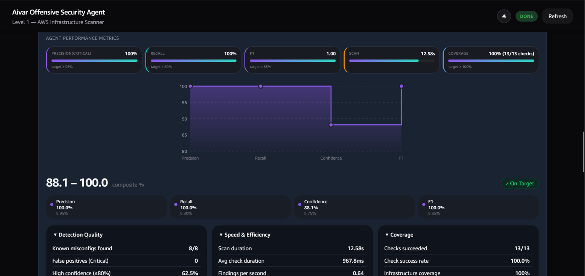

---

## Level 2 — Multi-Domain Scanner

Same 13 AWS checks plus three new domains, all running at the same time.

**API endpoint scanner** — sends real HTTP requests and checks for: missing authentication, CORS misconfiguration, no rate limiting, missing security headers, verbose error responses, dangerous HTTP methods.

**Dependency CVE scanner** — queries the OSV database for known vulnerabilities in your requirements files. Returns CVE ID, CVSS score, affected version, and fixed version.

**Secrets scanner** — twelve regex patterns looking for hardcoded credentials: AWS keys, API tokens, private keys, database connection strings. Has false-positive suppression for obvious placeholders.

After all four domains finish, every finding goes through deduplication (same check + resource + severity = one row, not four) and then gets sorted by a weighted impact score. The formula is severity times a domain weight times confidence. Secrets and AWS misconfigs score higher than CVEs because a hardcoded key is exploitable immediately — a vulnerable package in requirements.txt might not even be running.

The nine-stage pipeline has a live graph in the dashboard so you can watch data flow between domains as the scan runs.

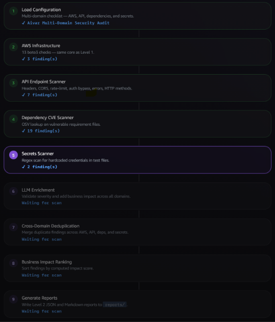

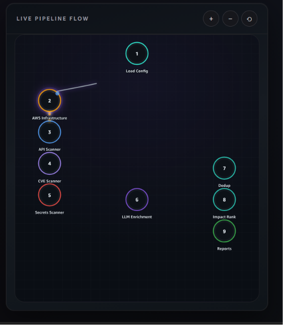

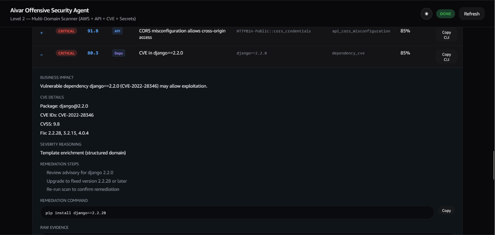

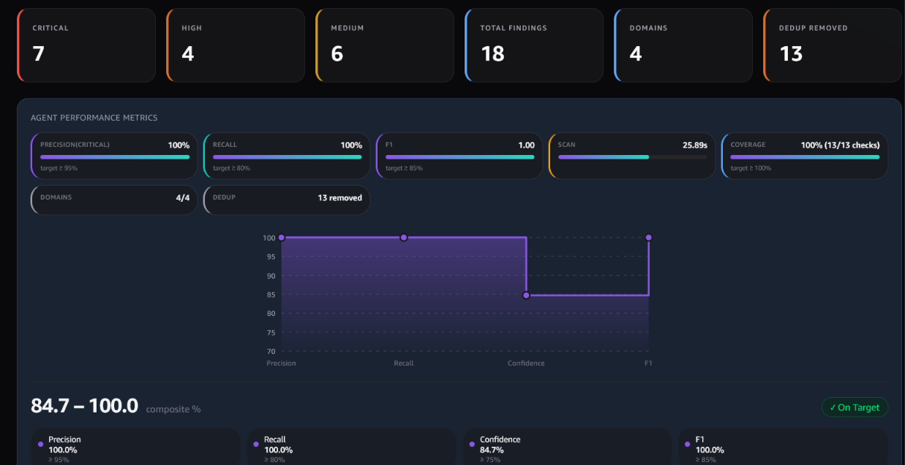

---

## Level 3 — Continuous Autonomous Scanning

This is where it becomes a proper service rather than a one-off tool.

**Schedule:** The daemon runs L3 scans on a schedule. Default is every 6 hours. You can set a custom interval in hours or minutes from the dashboard — no config file edit needed.

**Persistent findings:** Every finding gets a fingerprint based on check ID, resource ID, and severity. That fingerprint links scans across time. Instead of creating a new row every scan, the system updates the existing row. You get one record per misconfiguration for its entire life.

**Lifecycle states:** A finding starts as `opened`. If it shows up again on the next scan it becomes `updated`. If it disappears for three consecutive scans it auto-resolves — three, not one, because a single API error shouldn't mark a real problem as fixed. If a resolved finding comes back it becomes `re-opened`.

**SLA tracking:** Critical findings must be resolved within 24 hours. High within 72 hours. Medium within 7 days. If the deadline passes, the posture score penalty increases and a Slack alert fires.

**Slack escalation:** New Critical findings and SLA breaches post to a Slack webhook once per finding. Not on every scan — once. Alert fatigue is a real problem.

**Posture score:** A 0–100 number that drops based on open findings. Each Critical costs 25 points (40 if SLA is breached). Seven open Criticals gives you 0/100 — that's correct. The score is something teams can track over time. After at least two scans you also get a trend direction: Improving, Stable, or Degrading.

**Scan health:** Every check writes a row to the `scan_health` table — success or error with the exact error message. The dashboard shows this so you can never get a falsely clean report because a check failed quietly.

The Level 3 tab is a live SOC view — schedule controls, KPI cards, pipeline flow, posture chart, activity feed, and a lifecycle findings table.

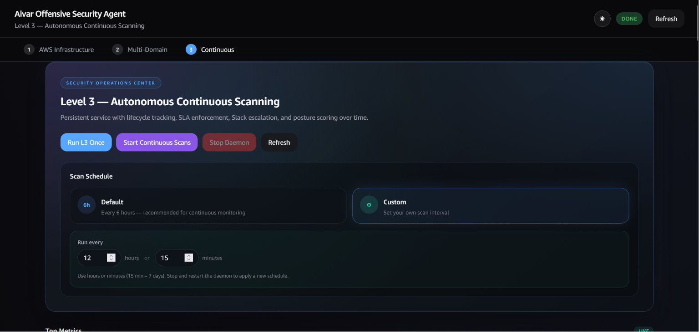

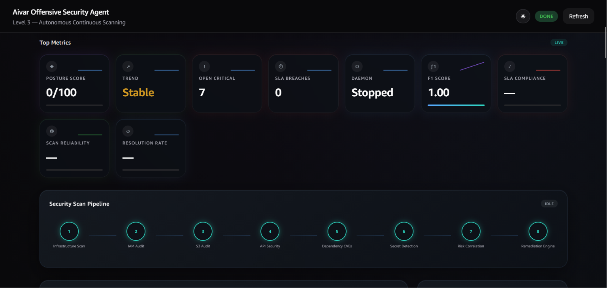

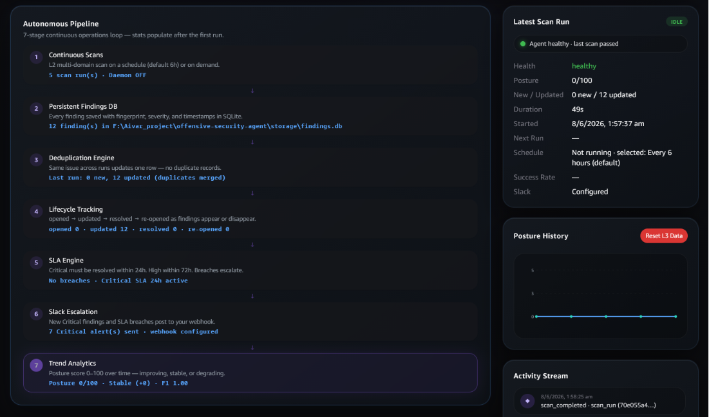

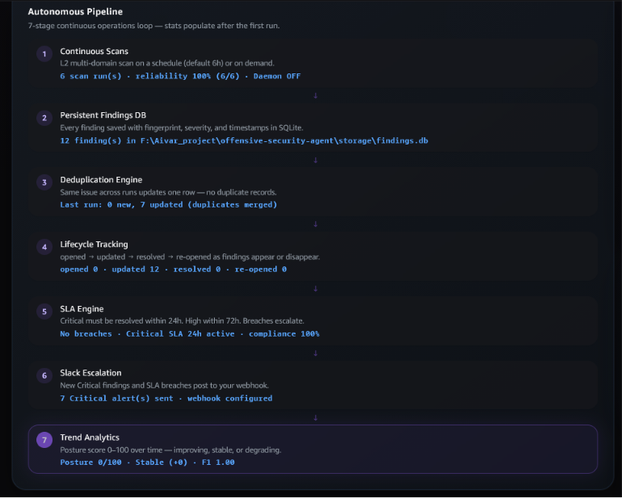

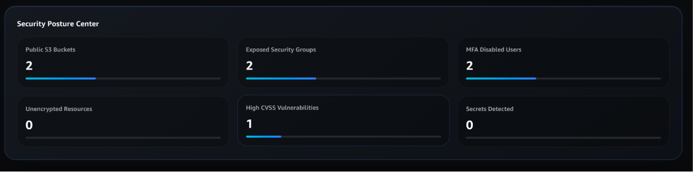

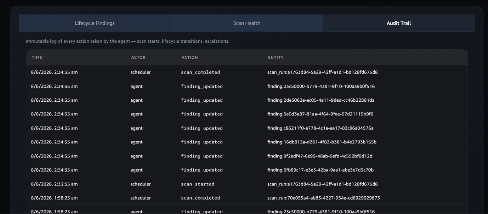

---

## Setup

**You need:** Python 3.10+, AWS credentials for `ap-south-1`, a free Groq API key.

```powershell
python -m venv venv
.\venv\Scripts\Activate.ps1
pip install -r requirements.txt
copy .env.example .env
# Fill in AWS_ACCESS_KEY_ID, AWS_SECRET_ACCESS_KEY, AWS_DEFAULT_REGION, GROQ_API_KEY
```

Start the dashboard:

```powershell
python -m uvicorn dashboard.app:app --host 127.0.0.1 --port 8080 --reload
```

Open `http://127.0.0.1:8080`. Pick a tab. Click Run.

---

## AWS credentials needed

Two IAM users:

| User | What it does | Credential file |
|------|-------------|-----------------|
| `aivar-scanner` | Runs all scans — read-only policies | `.env` |
| `aivar-admin` | Creates and deletes test misconfigs | `.env.admin` |

The scanner never needs write access. The admin user is only for the demo setup.

---

## Running the demo

Click **Run Full Demo** on the Level 1 tab. It creates the five test misconfigs, verifies the scanner can see them, runs the scan, and loads the report. Takes about 90 seconds.

Expected findings:

| Finding | Severity |
|---------|----------|
| Root MFA disabled | Critical |
| Public S3 bucket (ACL) | Critical |
| Public S3 bucket (policy) | Critical |
| Open SSH security group | Critical |
| Open RDP security group | Critical |
| IAM user without MFA | High |
| CloudTrail not logging | High |
| Weak password policy | Medium |

---

## CLI (if you prefer terminal over dashboard)

```powershell
python main.py --config checklist.yaml --verbose              # Level 1
python main.py --level 2 --config checklist_l2.yaml --verbose # Level 2
python main.py --level 3 --config checklist_l3.yaml --verbose # Level 3, one shot
python main.py --level 3 --config checklist_l3.yaml --daemon  # Level 3, continuous
```

---

## Verification

```powershell
python scripts\verify_acceptance.py        # ALL ACCEPTANCE CRITERIA PASSED
python scripts\verify_acceptance_l2.py     # ALL LEVEL 2 ACCEPTANCE CRITERIA PASSED
python scripts\verify_acceptance_l3.py     # ALL LEVEL 3 ACCEPTANCE CRITERIA PASSED
python scripts\verify_dashboard_buttons.py # All dashboard button API checks passed
```

Full end-to-end test that creates misconfigs, scans, then deletes everything:

```powershell
python scripts\run_full_test_and_cleanup.py
```

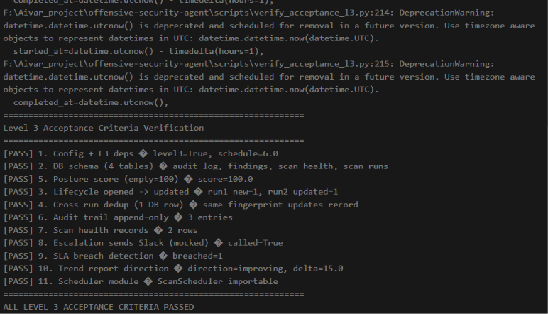

---

## Project structure

```
agent/          Orchestrators for L1/L2/L3, LLM intelligence, lifecycle, SLA, impact ranking
checks/         All detection code — boto3, HTTP, CVE, secrets
config/         YAML config loader
dashboard/      FastAPI backend + vanilla JS frontend
metrics/        Precision/recall/F1 calculator and ground truth registry
models/         Pydantic models for findings, reports, config
reporter/       JSON and Markdown report writers, trend reporter
scheduler/      APScheduler daemon for Level 3
scripts/        Acceptance tests, setup and cleanup scripts
storage/        SQLite models — findings, scan runs, audit log
checklist.yaml       Level 1 — 13 AWS checks
checklist_l2.yaml    Level 2 — adds API, CVE, secrets
checklist_l3.yaml    Level 3 — adds schedule, SLA, Slack settings
main.py              CLI entry point
```

---

## A note on the LLM quota

The free Groq tier has a daily token limit. When it's hit, the system falls back to template-based enrichment — structured remediation text without the LLM. Findings, severity, and evidence are not affected. All acceptance tests pass either way.
