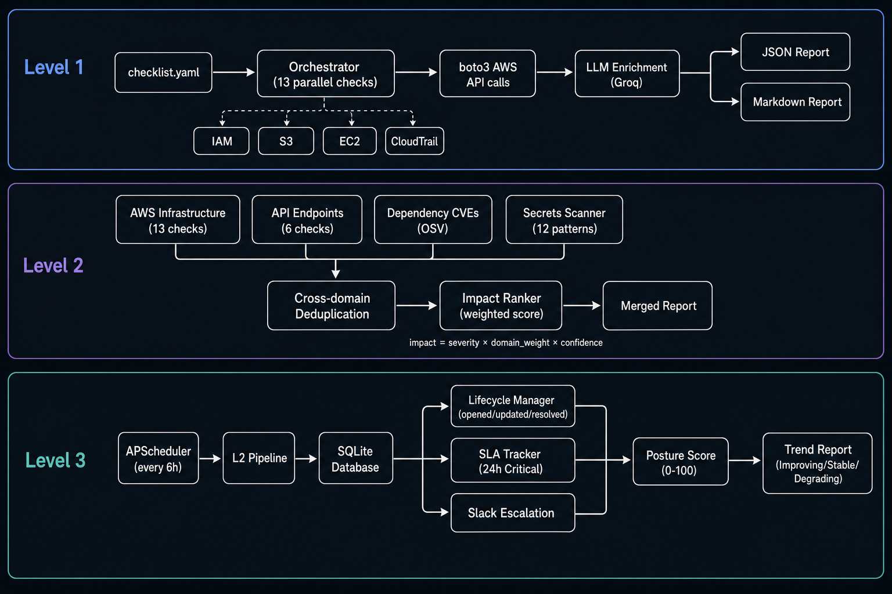

# Offensive Security Agent

**Aivar Innovations — AI/ML Engineering Hiring Challenge (June 2026)**

**Candidate:** Manikandan M  
**Repository:** [github.com/max-mani/offensive-security-agent](https://github.com/max-mani/offensive-security-agent)  
**Verified on:** AWS account `563999587682`, region `ap-south-1`, June 2026

An autonomous security agent that scans real AWS infrastructure, API endpoints, dependency files, and config files — then runs continuously on a schedule with lifecycle tracking, SLA enforcement, and Slack escalation.

All three levels are complete. Every demo runs against live AWS. No mocked findings.

---

## Results at a glance

| Level | What it does | Verified result |
|-------|--------------|-----------------|
| **Level 1** | 13 parallel AWS checks + LLM enrichment | 8 findings · 100% Critical precision · 100% recall · F1 1.00 |
| **Level 2** | AWS + API + CVE + secrets, deduped and ranked | 4 domains · cross-domain dedup · impact-ranked report |
| **Level 3** | Continuous daemon, SQLite persistence, SLA, Slack | Lifecycle · posture score · trend · scan health · 11/11 acceptance checks |

Automated verification (all pass on this build):

```powershell
python scripts\verify_acceptance.py
python scripts\verify_acceptance_l2.py
python scripts\verify_acceptance_l3.py
```


---

## Architecture

Three layers. Each level builds on the last without breaking what came before.

<p align="center">
  
</p>

**Level 1** — `checklist.yaml` drives 13 parallel boto3 checks. Raw findings go to Groq for business impact and remediation. Output is JSON + Markdown reports.

**Level 2** — Four domains run in parallel (AWS, API, dependencies, secrets). Findings are deduplicated by fingerprint, then ranked by a weighted impact score: `severity × domain_weight × confidence`. Secrets and AWS misconfigs rank above CVEs because they are exploitable immediately.

**Level 3** — APScheduler runs the L2 pipeline on a schedule (default 6 hours, custom interval from the dashboard). Findings persist in SQLite with lifecycle states (`opened` → `updated` → `resolved` → `re-opened`). SLA breaches and new Criticals escalate to Slack once per finding. Posture score (0–100) and trend direction track improvement over time.

---

## The design decision that matters most

**The LLM never creates findings. It only enriches them.**

Every Critical severity comes from a direct API response — `AccountMFAEnabled=0`, public S3 grants, `0.0.0.0/0` on port 22. The model explains the risk and suggests a fix. It cannot downgrade severity or remove a finding.

High-stakes checks are listed in `DETERMINISTIC_EVIDENCE` inside `agent/intelligence.py`. Even if the LLM expresses uncertainty, the API evidence stands. That is how this project hits zero false positives on Critical findings.

The scanner user is read-only. A separate admin user creates demo misconfigs. The agent never needs write access to your account.

---

## Level 1 — AWS Infrastructure Scanner

13 checks across IAM, S3, EC2, and CloudTrail. Configured in `checklist.yaml`. Each check can be enabled, disabled, or capped by severity.

| Category | Checks |
|----------|--------|
| IAM | Root MFA, root access keys, user MFA, unused keys, password policy |
| S3 | Public ACL, public policy, encryption disabled |
| EC2 / network | SSH open to internet, RDP open to internet, unencrypted EBS |
| Audit | CloudTrail logging, public EBS snapshots |

Click **Run Full Demo** on the dashboard. It creates five intentional misconfigs, verifies the scanner sees them, runs the scan, and loads the report — about 90 seconds end to end.

<p align="center">
  
</p>

<p align="center">
  
  &nbsp;&nbsp;
  
</p>

**Live demo output:** 8 findings (5 Critical, 2 High, 1 Medium) · scan ~87s · 13/13 checks succeeded

<p align="center">
  
</p>

Five findings are the misconfigs I injected. Three are real baseline issues on the account — root MFA off, CloudTrail not logging, weak password policy.

Every Critical row has raw boto3 evidence attached. The LLM wrote the impact text and remediation command; severity came from the check.

<p align="center">
  
</p>

<p align="center">
  
</p>

---

## Level 2 — Multi-Domain Scanner

Same 13 AWS checks plus three new attack surfaces, all running in parallel.

| Domain | What it checks |
|--------|----------------|
| **API endpoints** | Auth bypass, CORS, rate limiting, security headers, error disclosure, HTTP methods |
| **Dependencies** | OSV CVE lookup — CVE ID, CVSS, affected version, fixed version |
| **Secrets** | 12 regex patterns for AWS keys, tokens, private keys, connection strings |

After all domains finish: deduplicate (same check + resource + severity = one row), rank by impact score, write merged report.

The dashboard shows a nine-stage pipeline and a live graph — you watch data flow between AWS, API, dependencies, and secrets as the scan runs.

<p align="center">
  
</p>

<p align="center">
  
</p>

<p align="center">
  
  &nbsp;&nbsp;
  
</p>

---

## Level 3 — Continuous Autonomous Scanning

This is a running service, not a one-off script.

| Capability | Detail |
|------------|--------|
| **Schedule** | Default every 6 hours; custom interval in hours or minutes from the dashboard |
| **Persistence** | SQLite — one row per finding fingerprint across all scans |
| **Lifecycle** | `opened` → `updated` → `resolved` (after 3 consecutive misses) → `re-opened` |
| **SLA** | Critical 24h · High 72h · Medium 7 days · breach increases posture penalty |
| **Slack** | New Criticals and SLA breaches — once per finding, not every scan |
| **Posture score** | 0–100 penalty model; trend after 2+ scans (Improving / Stable / Degrading) |
| **Scan health** | Every check logs success or error — a failed check never looks like a clean bill of health |

The Continuous tab is a SOC-style dashboard: KPI cards, pipeline hero, posture chart, activity feed, critical findings list, and lifecycle table.

<p align="center">
  
</p>

<p align="center">
  
</p>

<p align="center">
  
  &nbsp;&nbsp;
  
</p>

<p align="center">
  
</p>

<p align="center">
  
</p>

---

## Quick start

**Requirements:** Python 3.10+ · AWS credentials for `ap-south-1` · free [Groq API key](https://console.groq.com)

```powershell
python -m venv venv
.\venv\Scripts\Activate.ps1
pip install -r requirements.txt
copy .env.example .env
# Add AWS_ACCESS_KEY_ID, AWS_SECRET_ACCESS_KEY, AWS_DEFAULT_REGION, GROQ_API_KEY
```

Start the dashboard:

```powershell
python -m uvicorn dashboard.app:app --host 127.0.0.1 --port 8080 --reload
```

Open **http://127.0.0.1:8080** → pick a level tab → click Run.

### AWS credentials

| User | Role | File |
|------|------|------|
| `aivar-scanner` | Read-only — runs every scan | `.env` |
| `aivar-admin` | Admin — creates/deletes demo resources only | `.env.admin` |

### Expected demo findings (Run Full Demo)

| Finding | Severity |
|---------|----------|
| Root MFA disabled | Critical |
| Public S3 bucket (ACL) | Critical |
| Public S3 bucket (policy) | Critical |
| Open SSH security group | Critical |
| Open RDP security group | Critical |
| IAM user without MFA | High |
| CloudTrail not logging | High |
| Weak password policy | Medium |

### CLI

```powershell
python main.py --config checklist.yaml --verbose               # Level 1
python main.py --level 2 --config checklist_l2.yaml --verbose  # Level 2
python main.py --level 3 --config checklist_l3.yaml --verbose  # Level 3, one shot
python main.py --level 3 --config checklist_l3.yaml --daemon   # Level 3, continuous
```

### Full verification suite

```powershell
python scripts\verify_acceptance.py
python scripts\verify_acceptance_l2.py
python scripts\verify_acceptance_l3.py
python scripts\verify_dashboard_buttons.py
python scripts\run_full_test_and_cleanup.py   # setup → scan → cleanup
```

---

## Project layout

```
agent/              Orchestrators (L1/L2/L3), LLM intelligence, lifecycle, SLA, impact ranking
checks/             boto3 checks, API checks, CVE scanner, secrets scanner
config/             YAML checklist loader
dashboard/          FastAPI backend + vanilla JS frontend (SOC dashboard)
metrics/            Precision/recall/F1 calculator, ground truth registry
models/             Pydantic models
reporter/           JSON, Markdown, and trend reporters
scheduler/          APScheduler daemon for Level 3
scripts/            Acceptance tests, setup, cleanup
storage/            SQLite — findings, scan runs, audit log
checklist.yaml          Level 1 — 13 AWS checks
checklist_l2.yaml       Level 2 — adds API, CVE, secrets
checklist_l3.yaml       Level 3 — schedule, SLA, Slack settings
main.py                 CLI entry point
```

---

## Notes

**LLM quota:** Groq free tier has a daily limit. When it is hit, template enrichment takes over. Findings, severity, and evidence are unchanged. All acceptance tests pass either way.

**Slack (optional):** Set `SLACK_WEBHOOK_URL` in `.env` for Critical and SLA breach alerts.

**Video walkthrough:** See [`docs/video-script.md`](docs/video-script.md) for a 4-minute demo script.
